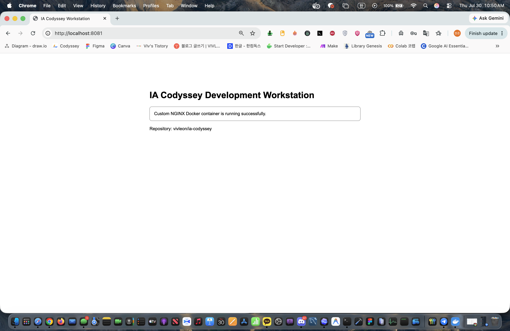
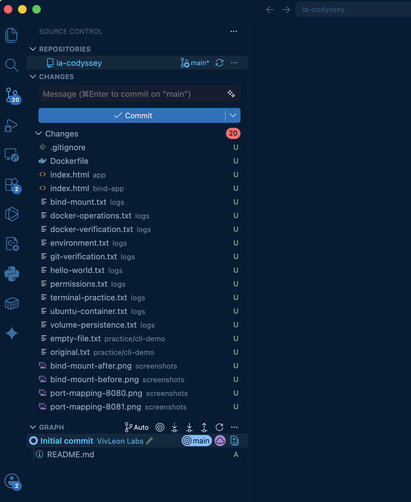

# IA Codyssey Development Workstation

터미널, Docker, Git 및 GitHub를 활용하여 재현 가능한 개발 워크스테이션을 구축하고 검증한 프로젝트입니다.

- Repository: `vivleon/ia-codyssey`
- Base Image: `nginx:alpine`
- Custom Image: `ia-codyssey-web:1.0`
- Port Mapping: `8080:80`, `8081:80`

---

## 1. 프로젝트 개요

이 프로젝트의 목표는 개발 워크스테이션을 직접 구성하고, 동일한 서비스를 반복 실행해도 같은 결과가 재현되는 환경을 만드는 것입니다.

다음 항목을 터미널 기반으로 수행했습니다.

- 파일 및 디렉토리 생성·복사·이동·삭제
- 절대 경로와 상대 경로 확인
- 파일 및 디렉토리 권한 변경
- Docker 설치와 Docker Engine 동작 점검
- Docker 이미지 및 컨테이너 운영
- Dockerfile 기반 커스텀 이미지 제작
- 포트 매핑을 통한 웹 서버 접속
- 바인드 마운트를 통한 변경사항 실시간 반영
- Docker 볼륨을 통한 데이터 영속성 검증
- Git 로컬 버전 관리와 GitHub 원격 저장소 연동
- VSCode Source Control과 GitHub 저장소 연동

---

## 2. 실행 환경

| 항목 | 환경 |
|---|---|
| OS | macOS 26.5.2 |
| Architecture | arm64 |
| Shell | /bin/zsh |
| Terminal | Apple_Terminal |
| Container Runtime | Docker Desktop |
| Docker Desktop | 4.68.0 |
| Docker Engine | 29.3.1 |
| Docker Context | `desktop-linux` |
| Git | 2.52.0 |
| Git User | `vivleon` |
| Default Branch | `main` |

Docker 클라이언트는 macOS에서 실행되며, 실제 컨테이너는 Docker Desktop이 제공하는 Linux 환경에서 실행됩니다.

상세 환경 확인 결과:

- [실행 환경 로그](logs/environment.txt)
- [Docker 검증 로그](logs/docker-verification.txt)
- [Git 검증 로그](logs/git-verification.txt)

---

## 3. 수행 체크리스트

- [x] GitHub Repository 생성
- [x] GitHub Repository clone
- [x] 현재 위치 확인
- [x] 숨김 파일을 포함한 목록 확인
- [x] 디렉토리 생성 및 이동
- [x] 파일 생성 및 내용 확인
- [x] 빈 파일 생성
- [x] 파일 복사
- [x] 파일 이동 및 이름 변경
- [x] 파일 삭제
- [x] 절대 경로와 상대 경로 확인
- [x] 파일 권한 변경
- [x] 디렉토리 권한 변경
- [x] Docker 버전 확인
- [x] Docker Engine 동작 확인
- [x] `hello-world` 컨테이너 실행
- [x] Ubuntu 컨테이너 실행
- [x] Ubuntu 컨테이너 내부 명령 실행
- [x] Docker 이미지 목록 확인
- [x] Docker 컨테이너 실행·중지·목록 확인
- [x] Docker 컨테이너 로그 확인
- [x] Docker 리소스 사용량 확인
- [x] Dockerfile 직접 작성
- [x] 커스텀 이미지 빌드
- [x] 포트 매핑 및 브라우저 접속
- [x] 동일 이미지의 다중 컨테이너 실행
- [x] 바인드 마운트 변경 전후 검증
- [x] Docker 볼륨 영속성 검증
- [x] Git 사용자 정보 설정
- [x] Git 기본 브랜치 설정
- [x] GitHub 원격 저장소 연결
- [x] VSCode Source Control 연동
- [x] 민감정보 노출 여부 확인

---

## 4. 프로젝트 구조

```text
ia-codyssey/
├── app/
│   └── index.html
├── bind-app/
│   └── index.html
├── logs/
│   ├── bind-mount.txt
│   ├── docker-operations.txt
│   ├── docker-verification.txt
│   ├── environment.txt
│   ├── git-verification.txt
│   ├── hello-world.txt
│   ├── permissions.txt
│   ├── terminal-practice.txt
│   ├── ubuntu-container.txt
│   └── volume-persistence.txt
├── practice/
│   └── cli-demo/
│       ├── empty-file.txt
│       └── original.txt
├── screenshots/
│   ├── bind-mount-after.png
│   ├── bind-mount-before.png
│   ├── port-mapping-8080.png
│   ├── port-mapping-8081.png
│   └── vscode-github-link.png
├── .gitignore
├── Dockerfile
└── README.md
```

---

## 5. 터미널 기본 조작

터미널에서 현재 위치 확인, 목록 확인, 디렉토리 이동, 파일 생성, 복사, 이름 변경 및 삭제를 수행했습니다.

```bash
pwd
ls -la

mkdir -p practice/cli-demo
cd practice/cli-demo

touch empty-file.txt

echo "Terminal CLI practice" > original.txt
cat original.txt

cp original.txt copied.txt
mv copied.txt renamed.txt
rm renamed.txt

ls -la
```

전체 명령 및 출력 결과:

- [터미널 조작 로그](logs/terminal-practice.txt)

### 5.1 절대 경로

절대 경로는 파일시스템의 루트부터 대상까지 전체 위치를 나타냅니다.

```text
/Users/hyeonjunna/codyssey/ia-codyssey/app/index.html
```

현재 작업 디렉토리가 변경되어도 항상 같은 대상을 가리킵니다.

### 5.2 상대 경로

상대 경로는 현재 작업 디렉토리를 기준으로 대상의 위치를 나타냅니다.

```text
./app/index.html
```

현재 작업 디렉토리에 따라 가리키는 대상이 달라질 수 있습니다.

---

## 6. 파일 및 디렉토리 권한

Unix 계열 시스템의 기본 권한은 읽기, 쓰기, 실행으로 구성됩니다.

| 기호 | 숫자 | 의미 |
|---|---:|---|
| `r` | 4 | 읽기 |
| `w` | 2 | 쓰기 |
| `x` | 1 | 실행 또는 디렉토리 접근 |

### 6.1 파일 권한 변경

```bash
chmod 600 app/index.html
chmod 644 app/index.html
```

`644`는 다음과 같이 해석됩니다.

```text
6 = 4 + 2 = rw-
4 = r--
4 = r--

rw-r--r--
```

- 소유자: 읽기 및 쓰기
- 그룹: 읽기
- 기타 사용자: 읽기

### 6.2 디렉토리 권한 변경

```bash
chmod 700 practice
chmod 755 practice
```

`755`는 다음과 같이 해석됩니다.

```text
7 = 4 + 2 + 1 = rwx
5 = 4 + 1 = r-x
5 = 4 + 1 = r-x

rwxr-xr-x
```

- 소유자: 읽기, 쓰기 및 접근
- 그룹: 읽기 및 접근
- 기타 사용자: 읽기 및 접근

변경 전후 결과:

- [권한 실습 로그](logs/permissions.txt)

---

## 7. Docker 설치 및 기본 점검

Docker 버전을 확인했습니다.

```bash
docker --version
```

Docker 클라이언트와 서버 정보를 확인했습니다.

```bash
docker version
```

Docker Engine의 동작 여부와 실행 환경을 확인했습니다.

```bash
docker info
```

주요 확인 결과:

```text
Client OS/Arch: darwin/arm64
Server OS/Arch: linux/arm64
Docker Context: desktop-linux
Docker Engine: 29.3.1
Docker Desktop: 4.68.0
```

Docker 클라이언트와 Docker 데몬이 정상적으로 통신하고 있음을 확인했습니다.

---

## 8. hello-world 컨테이너

Docker 기본 동작을 확인하기 위해 `hello-world` 이미지를 실행했습니다.

```bash
docker run --name ia-hello-world hello-world
```

핵심 실행 결과:

```text
Hello from Docker!
This message shows that your installation appears to be working correctly.
```

실행 과정은 다음과 같습니다.

1. Docker 클라이언트가 Docker 데몬에 요청합니다.
2. 로컬에 이미지가 없으면 Docker Hub에서 이미지를 내려받습니다.
3. 내려받은 이미지로 새로운 컨테이너를 생성합니다.
4. 컨테이너를 실행하고 출력 결과를 터미널에 전달합니다.
5. 실행이 끝난 컨테이너는 `Exited` 상태가 됩니다.

전체 실행 결과:

- [hello-world 로그](logs/hello-world.txt)

---

## 9. Ubuntu 컨테이너

Ubuntu 컨테이너를 생성하고 내부 셸에 진입했습니다.

```bash
docker run -it --name ubuntu-practice ubuntu bash
```

컨테이너 내부에서 다음 명령을 실행했습니다.

```bash
pwd
ls -la
echo "Hello from Ubuntu container"
cat /etc/os-release
whoami
uname -a
```

`exit`를 입력하면 컨테이너의 메인 프로세스인 `bash`가 종료되므로 컨테이너도 `Exited` 상태가 됩니다.

### 9.1 계속 실행되는 컨테이너

```bash
docker run -d \
  --name ia-ubuntu-running \
  ubuntu \
  sleep infinity
```

실행 중인 컨테이너 내부에서 별도 명령을 실행했습니다.

```bash
docker exec ia-ubuntu-running pwd
docker exec ia-ubuntu-running ls -la /
docker exec ia-ubuntu-running cat /etc/os-release
docker exec ia-ubuntu-running whoami
```

전체 실행 결과:

- [Ubuntu 컨테이너 로그](logs/ubuntu-container.txt)

### 9.2 run, attach, exec 차이

| 명령 | 역할 |
|---|---|
| `docker run` | 이미지에서 새로운 컨테이너를 생성하고 실행 |
| `docker attach` | 실행 중인 컨테이너의 메인 프로세스 입출력에 연결 |
| `docker exec` | 실행 중인 컨테이너 안에서 새로운 별도 프로세스 실행 |

`docker exec`로 실행한 명령이 종료되어도 컨테이너의 메인 프로세스가 살아 있으면 컨테이너는 계속 실행됩니다.

반면 컨테이너의 메인 프로세스가 종료되면 컨테이너도 종료됩니다.

---

## 10. Docker 기본 운영 명령

이미지 목록을 확인했습니다.

```bash
docker images
```

실행 중인 컨테이너 목록을 확인했습니다.

```bash
docker ps
```

종료된 컨테이너를 포함한 전체 목록을 확인했습니다.

```bash
docker ps -a
```

컨테이너 로그를 확인했습니다.

```bash
docker logs ia-codyssey-web-8080
docker logs --tail 20 ia-codyssey-web-8080
```

컨테이너별 리소스 사용량을 확인했습니다.

```bash
docker stats --no-stream
```

전체 실행 결과:

- [Docker 운영 로그](logs/docker-operations.txt)
- [Docker 종합 검증 로그](logs/docker-verification.txt)

### 10.1 이미지와 컨테이너의 차이

Docker 이미지는 애플리케이션과 실행 환경을 포함한 읽기 전용 템플릿입니다.

Docker 컨테이너는 이미지를 기반으로 생성된 실행 인스턴스입니다.

하나의 이미지로 서로 독립된 여러 컨테이너를 생성할 수 있습니다.

---

## 11. 커스텀 Docker 이미지

경량 NGINX 웹 서버 이미지인 `nginx:alpine`을 베이스 이미지로 선택했습니다.

### 11.1 Dockerfile

```dockerfile
FROM nginx:alpine

LABEL org.opencontainers.image.title="ia-codyssey-web"
LABEL org.opencontainers.image.description="Custom NGINX image for development workstation mission"
LABEL org.opencontainers.image.source="https://github.com/vivleon/ia-codyssey"

ENV APP_ENV=development

COPY app/ /usr/share/nginx/html/

EXPOSE 80

HEALTHCHECK --interval=30s --timeout=3s --start-period=5s --retries=3 \
  CMD wget -qO- http://localhost/ || exit 1
```

### 11.2 커스텀 적용 내용

| 항목 | 목적 |
|---|---|
| `FROM nginx:alpine` | 경량 NGINX 웹 서버 환경 사용 |
| `LABEL` | 이미지의 제목, 설명 및 출처 기록 |
| `ENV` | 실행 환경 정보를 코드와 분리 |
| `COPY` | 직접 작성한 정적 웹 페이지를 이미지에 포함 |
| `EXPOSE 80` | 웹 서버가 사용하는 컨테이너 포트 명시 |
| `HEALTHCHECK` | NGINX 웹 서버 응답 상태 점검 |

### 11.3 이미지 빌드

```bash
docker build -t ia-codyssey-web:1.0 .
```

빌드 결과 확인:

```bash
docker images ia-codyssey-web
```

### 11.4 컨테이너 실행

```bash
docker run -d \
  --name ia-codyssey-web-8080 \
  -p 8080:80 \
  ia-codyssey-web:1.0
```

---

## 12. 포트 매핑

컨테이너 내부의 NGINX는 80번 포트에서 실행됩니다.

컨테이너 네트워크는 호스트 환경과 격리되어 있기 때문에 호스트에서 서비스에 접근하려면 포트 매핑이 필요합니다.

```bash
-p 8080:80
```

위 설정은 호스트의 8080번 포트를 컨테이너의 80번 포트에 연결합니다.

```text
Browser
  ↓
localhost:8080
  ↓
Host port 8080
  ↓
Container port 80
  ↓
NGINX
```

포트 매핑 확인:

```bash
docker port ia-codyssey-web-8080
```

웹 응답 확인:

```bash
curl http://localhost:8080
```

### 12.1 8080 포트 접속 증거


### 12.2 8081 포트 접속 증거

동일한 이미지로 두 번째 컨테이너를 실행했습니다.

```bash
docker run -d \
  --name ia-codyssey-web-8081 \
  -p 8081:80 \
  ia-codyssey-web:1.0
```



동일한 이미지에서 생성한 컨테이너를 서로 다른 호스트 포트로 동시에 실행할 수 있음을 확인했습니다.

---

## 13. 바인드 마운트

호스트의 `bind-app` 디렉토리를 NGINX 웹 콘텐츠 경로에 연결했습니다.

```bash
docker run -d \
  --name ia-codyssey-bind \
  -p 8082:80 \
  -v "$(pwd)/bind-app:/usr/share/nginx/html:ro" \
  nginx:alpine
```

호스트 파일을 변경하기 전의 내용:

```text
Bind Mount Test - BEFORE
```

### 변경 전 화면


호스트의 `bind-app/index.html`을 수정한 뒤 컨테이너 재시작이나 이미지 재빌드 없이 다시 접속했습니다.

변경 후의 내용:

```text
Bind Mount Test - AFTER
```

### 변경 후 화면


호스트 파일 변경이 실행 중인 컨테이너에 즉시 반영되는 것을 확인했습니다.

전체 검증 결과:

- [바인드 마운트 로그](logs/bind-mount.txt)

---

## 14. Docker 볼륨 영속성

Docker 볼륨을 생성했습니다.

```bash
docker volume create ia-codyssey-data
```

첫 번째 컨테이너에 볼륨을 연결했습니다.

```bash
docker run -d \
  --name ia-volume-test-1 \
  -v ia-codyssey-data:/data \
  ubuntu \
  sleep infinity
```

첫 번째 컨테이너에서 데이터를 기록했습니다.

```bash
docker exec ia-volume-test-1 \
  sh -c 'echo "Persistent data created by container 1" > /data/result.txt'
```

데이터를 확인했습니다.

```bash
docker exec ia-volume-test-1 cat /data/result.txt
```

첫 번째 컨테이너를 삭제했습니다.

```bash
docker rm -f ia-volume-test-1
```

동일한 볼륨을 연결해 두 번째 컨테이너를 실행했습니다.

```bash
docker run -d \
  --name ia-volume-test-2 \
  -v ia-codyssey-data:/data \
  ubuntu \
  sleep infinity
```

두 번째 컨테이너에서 데이터를 확인했습니다.

```bash
docker exec ia-volume-test-2 cat /data/result.txt
```

결과:

```text
Persistent data created by container 1
```

첫 번째 컨테이너가 삭제된 후에도 Docker 볼륨에 저장된 데이터가 유지됨을 확인했습니다.

전체 검증 결과:

- [Docker 볼륨 영속성 로그](logs/volume-persistence.txt)

### 14.1 바인드 마운트와 볼륨 비교

| 구분 | 바인드 마운트 | Docker 볼륨 |
|---|---|---|
| 저장 위치 | 사용자가 지정한 호스트 경로 | Docker가 관리하는 저장 영역 |
| 주요 목적 | 소스와 설정의 변경사항 즉시 반영 | 영속 데이터 보관 |
| 호스트 경로 의존성 | 상대적으로 높음 | 상대적으로 낮음 |
| 관리 주체 | 사용자 | Docker |
| 주요 사례 | 개발 중 소스코드 연결 | 데이터베이스 데이터 저장 |

---

## 15. Git 및 GitHub 연동

Git 사용자 정보와 기본 브랜치를 설정했습니다.

```bash
git config --global user.name "vivleon"
git config --global init.defaultBranch main
```

보안을 위해 이메일 주소는 공개 로그와 README에 표시하지 않았습니다.

현재 브랜치 확인:

```bash
git branch --show-current
```

결과:

```text
main
```

원격 저장소 확인:

```bash
git remote -v
```

결과:

```text
origin  https://github.com/vivleon/ia-codyssey.git
```

Git 설정 및 원격 저장소 확인 결과:

- [Git 검증 로그](logs/git-verification.txt)

### 15.1 Git과 GitHub의 차이

Git은 로컬 컴퓨터에서 소스코드의 변경 이력과 브랜치를 관리하는 버전 관리 도구입니다.

GitHub는 Git 저장소를 원격으로 보관하고 협업, 코드 리뷰, 이슈 관리 및 접근 제어 기능을 제공하는 플랫폼입니다.

### 15.2 VSCode Source Control 연동

VSCode에서 다음 사항을 확인했습니다.

- Repository: `ia-codyssey`
- Branch: `main`
- Source Control 변경 파일 인식
- Git 저장소 정상 연결



---

## 16. 트러블슈팅

### 16.1 git config 명령이 중단된 것처럼 보임

#### 문제

다음 명령을 실행한 후 화면 하단에 `(END)`가 표시됐습니다.

```bash
git config --global --list
```

명령 실행이 멈춘 것으로 판단해 `Ctrl + Z`를 입력했고 프로세스가 suspended 상태가 됐습니다.

#### 원인 가설

Git 설정 출력이 많아 `less` 페이저가 실행된 것으로 판단했습니다.

#### 확인

터미널에서 작업 상태를 확인했습니다.

```bash
jobs
```

`git config` 프로세스가 suspended 상태로 표시됐습니다.

#### 해결

페이저 화면에서는 `q`를 눌러 정상 종료합니다.

페이저를 사용하지 않고 출력하려면 다음 명령을 사용합니다.

```bash
git --no-pager config --global --list
```

#### 결과

Git 전역 설정값을 정상적으로 확인하고 터미널 프롬프트로 복귀했습니다.

---

### 16.2 Ubuntu 컨테이너 내부에서 Docker 명령 실행 실패

#### 문제

Ubuntu 컨테이너 내부에서 Docker 명령을 다시 실행했습니다.

```bash
docker run -it --name ubuntu-practice ubuntu bash
```

실행 결과:

```text
bash: docker: command not found
```

#### 원인 가설

현재 위치가 macOS 호스트가 아니라 격리된 Ubuntu 컨테이너 내부였으며, Ubuntu 기본 이미지에 Docker CLI가 설치되어 있지 않은 것으로 판단했습니다.

#### 확인

터미널 프롬프트가 다음 형태로 표시됐습니다.

```text
root@<container-id>:/#
```

이는 현재 셸이 Ubuntu 컨테이너 내부에서 실행되고 있음을 의미합니다.

#### 해결

`exit` 명령으로 컨테이너에서 나온 뒤 Docker 관리 명령을 macOS 호스트에서 실행했습니다.

컨테이너 내부에서는 다음과 같은 Linux 명령만 실행했습니다.

```bash
pwd
ls
echo
cat /etc/os-release
```

#### 결과

호스트는 Docker 컨테이너의 생성 및 운영을 담당하고, 컨테이너 내부는 격리된 애플리케이션 실행 환경이라는 역할 차이를 확인했습니다.

---

## 17. 보안 및 개인정보 보호

다음 민감정보가 저장소, 로그 및 스크린샷에 포함되지 않도록 점검했습니다.

- 비밀번호
- GitHub Personal Access Token
- API Key
- 개인키
- 인증 코드
- 클라우드 접근 자격 증명
- 전체 이메일 주소

`.gitignore`에는 다음 항목을 등록했습니다.

```gitignore
.DS_Store
.env
.env.*
*.pem
*.key
*.log
node_modules/
dist/
build/
```

민감정보가 Git 이력에 커밋된 경우 현재 파일에서 삭제하는 것만으로는 충분하지 않습니다.

Git 이력에서 해당 정보를 제거하고, 노출된 자격 증명을 폐기한 뒤 재발급해야 합니다.

---

## 18. 재현 방법

저장소를 복제합니다.

```bash
git clone https://github.com/vivleon/ia-codyssey.git
cd ia-codyssey
```

커스텀 이미지를 빌드합니다.

```bash
docker build -t ia-codyssey-web:1.0 .
```

웹 서버 컨테이너를 실행합니다.

```bash
docker run -d \
  --name ia-codyssey-web-8080 \
  -p 8080:80 \
  ia-codyssey-web:1.0
```

웹 서버 응답을 확인합니다.

```bash
curl http://localhost:8080
```

브라우저 접속 주소:

```text
http://localhost:8080
```

컨테이너를 중지하고 삭제합니다.

```bash
docker stop ia-codyssey-web-8080
docker rm ia-codyssey-web-8080
```

---

## 19. 핵심 학습 내용

### 이미지와 컨테이너

이미지는 애플리케이션과 실행 환경을 포함하는 읽기 전용 템플릿입니다.

컨테이너는 이미지를 기반으로 생성된 실행 인스턴스입니다.

### 포트 매핑

컨테이너 네트워크는 호스트와 격리되어 있으므로, 호스트에서 컨테이너 내부 서비스에 접근하려면 포트 연결이 필요합니다.

### 바인드 마운트

호스트의 특정 파일이나 디렉토리를 컨테이너에 직접 연결합니다. 개발 중 소스코드와 설정 변경을 즉시 반영하는 데 적합합니다.

### Docker 볼륨

Docker가 관리하는 저장 공간입니다. 컨테이너가 삭제되어도 데이터를 유지할 수 있습니다.

### Git과 GitHub

Git은 로컬 버전 관리 도구이며, GitHub는 Git 저장소의 원격 보관과 협업을 위한 플랫폼입니다.

---

## 20. 검증 결과 및 증거

| 검증 항목 | 증거 |
|---|---|
| 실행 환경 | [environment.txt](logs/environment.txt) |
| 터미널 기본 조작 | [terminal-practice.txt](logs/terminal-practice.txt) |
| 권한 변경 | [permissions.txt](logs/permissions.txt) |
| hello-world 실행 | [hello-world.txt](logs/hello-world.txt) |
| Ubuntu 컨테이너 | [ubuntu-container.txt](logs/ubuntu-container.txt) |
| Docker 운영 | [docker-operations.txt](logs/docker-operations.txt) |
| Docker 종합 검증 | [docker-verification.txt](logs/docker-verification.txt) |
| 바인드 마운트 | [bind-mount.txt](logs/bind-mount.txt) |
| 볼륨 영속성 | [volume-persistence.txt](logs/volume-persistence.txt) |
| Git 설정 | [git-verification.txt](logs/git-verification.txt) |
| 8080 접속 화면 | [port-mapping-8080.png](screenshots/port-mapping-8080.png) |
| 8081 접속 화면 | [port-mapping-8081.png](screenshots/port-mapping-8081.png) |
| 바인드 마운트 변경 전 | [bind-mount-before.png](screenshots/bind-mount-before.png) |
| 바인드 마운트 변경 후 | [bind-mount-after.png](screenshots/bind-mount-after.png) |
| VSCode 연동 | [vscode-github-link.png](screenshots/vscode-github-link.png) |
