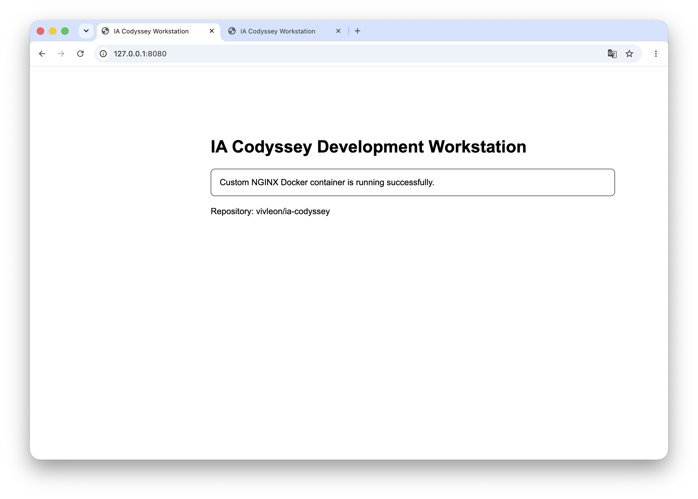
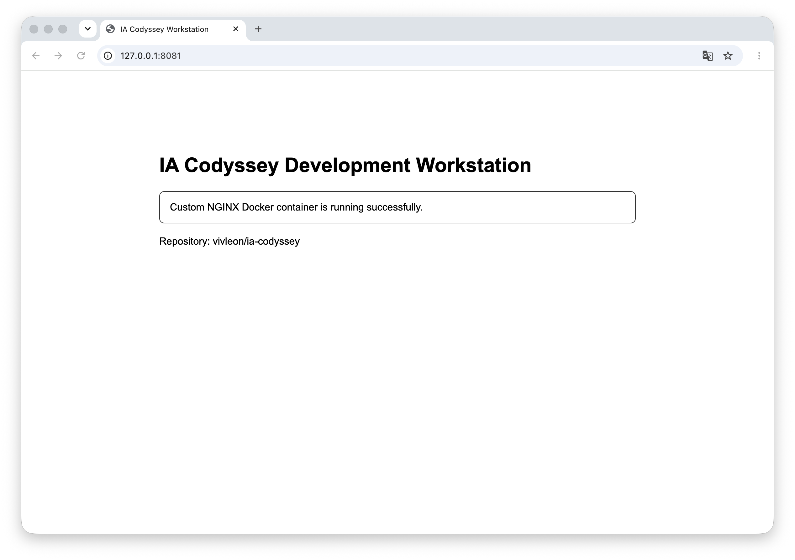
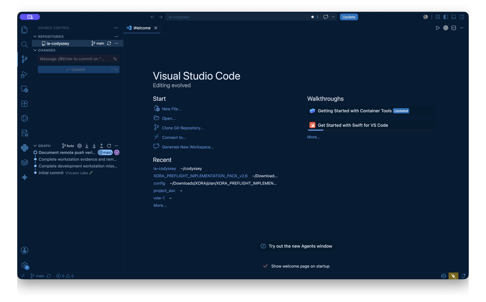

# IA Codyssey Development Workstation

터미널, Docker, Git 및 GitHub를 활용하여 재현 가능한 개발 워크스테이션을 구축하고 검증한 프로젝트입니다.

| 과제 정보 | 내용 |
|---|---|
| 분야 | 입학연수 |
| 구분 | 개발 입문 |
| 학습시간 | 40시간 |
| 미션 | 내 컴퓨터에 개발자용 작업실 꾸미기 |

- Repository: `vivleon/ia-codyssey`
- Base Image: `nginx:alpine@sha256:4a73073bd557c65b759505da037898b61f1be6cbcc3c2c3aeac22d2a470c1752`
- Custom Image: `ia-codyssey-web:1.0`
- Port Mapping: `8080:80`, `8081:80`, `8082:80` (bind mount)

> 동료평가에서는 [22. 평가 문항별 즉답 가이드](#22-평가-문항별-즉답-가이드)에서 질문별 답변과 원본 증거를 바로 확인할 수 있습니다.

---

## 1. 프로젝트 개요

이 프로젝트의 목표는 개발 워크스테이션을 직접 구성하고, 동일한 서비스를 반복 실행해도 같은 결과가 재현되는 환경을 만드는 것입니다.

다음 항목을 터미널 기반으로 수행했습니다.

- 파일 및 디렉토리 생성·복사·이동·삭제
- 절대 경로와 상대 경로 확인
- 파일 및 디렉토리 권한 변경
- Docker 설치와 Docker Engine 동작 점검
- Docker 이미지 및 컨테이너 운영
- Dockerfile 기반 커스텀 이미지 제작
- 포트 매핑을 통한 웹 서버 접속
- 바인드 마운트를 통한 변경사항 실시간 반영
- Docker 볼륨을 통한 데이터 영속성 검증
- Git 로컬 버전 관리와 GitHub 원격 저장소 연동
- VSCode Source Control과 GitHub 저장소 연동

---

## 2. 실행 환경

| 항목 | 환경 |
|---|---|
| OS | macOS 26.5.2 |
| Architecture | arm64 |
| Shell | /bin/zsh |
| Terminal | Apple_Terminal |
| Container Runtime | Docker Desktop |
| Docker Desktop | 4.68.0 |
| Docker Engine | 29.3.1 |
| Docker Context | `desktop-linux` |
| Git | 2.52.0 |
| Git User | `vivleon` |
| Default Branch | `main` |

Docker 클라이언트는 macOS에서 실행되며, 실제 컨테이너는 Docker Desktop이 제공하는 Linux 환경에서 실행됩니다.

위 환경은 2026년 8월 12일에 다시 확인했습니다. 현재 시스템에는 OrbStack이 설치되어 있지 않습니다. 서울캠퍼스 지침이 OrbStack 사용을 필수로 지정한 경우에는 제출 전에 OrbStack을 설치하고 `docker context show`, `docker version`, `docker info` 및 필수 실습 전체를 같은 런타임에서 다시 실행해야 합니다. 이 저장소는 존재하지 않는 OrbStack 실행 결과를 증거로 주장하지 않습니다.

상세 환경 확인 결과:

- [실행 환경 로그](logs/environment.txt)
- [Docker 검증 로그](logs/docker-verification.txt)
- [Git 검증 로그](logs/git-verification.txt)
- [이미지 빌드·실행 원본 로그](logs/image-build-run.txt)
- [자동 검증 로그](logs/automated-verification.txt)

---

## 3. 수행 체크리스트

- [x] GitHub Repository 생성
- [x] GitHub Repository clone
- [x] 현재 위치 확인
- [x] 숨김 파일을 포함한 목록 확인
- [x] 디렉토리 생성 및 이동
- [x] 파일 생성 및 내용 확인
- [x] 빈 파일 생성
- [x] 파일 복사
- [x] 파일 이동 및 이름 변경
- [x] 파일 삭제
- [x] 절대 경로와 상대 경로 확인
- [x] 파일 권한 변경
- [x] 디렉토리 권한 변경
- [x] Docker 버전 확인
- [x] Docker Engine 동작 확인
- [x] `hello-world` 컨테이너 실행
- [x] Ubuntu 컨테이너 실행
- [x] Ubuntu 컨테이너 내부 명령 실행
- [x] Docker 이미지 목록 확인
- [x] Docker 컨테이너 실행·중지·목록 확인
- [x] Docker 컨테이너 로그 확인
- [x] Docker 리소스 사용량 확인
- [x] 증거용 컨테이너와 이미지 삭제 결과 확인
- [x] Dockerfile 직접 작성
- [x] 커스텀 이미지 빌드
- [x] 빌드 컨텍스트 최소화 및 베이스 이미지 digest 고정
- [x] 포트 매핑 및 브라우저 접속
- [x] 동일 이미지의 다중 컨테이너 실행
- [x] 포트 충돌 재현·점유 프로세스 확인·대체 포트 해결
- [x] 바인드 마운트 변경 전후 검증
- [x] Docker 볼륨 영속성 검증
- [x] Docker 볼륨 tar 백업·원본 삭제·새 볼륨 복원 검증
- [x] Git 사용자 정보 설정
- [x] Git 기본 브랜치 설정
- [x] GitHub 원격 저장소 연결
- [x] VSCode Source Control clean 상태 및 GitHub 로그인·실제 push 검증
- [x] 민감정보 노출 여부 확인
- [x] 빌드→HTTP 200→health→바인드→볼륨 자동 검증
- [x] 터미널 작업별 UTC 시작·종료·종료 코드 기록
- [x] 볼륨 복원 후 mode·UID·GID 일치 검증
- [x] 프로젝트 핵심 구조 및 README 로컬 링크 자동 검증

---

## 4. 프로젝트 구조

```text
ia-codyssey/
├── app/
│   └── index.html
├── bind-app/
│   └── index.html
├── logs/
│   ├── bind-mount.txt
│   ├── automated-verification.txt
│   ├── docker-cleanup-summary.txt
│   ├── docker-operations.txt
│   ├── docker-verification.txt
│   ├── environment.txt
│   ├── git-push.txt
│   ├── git-verification.txt
│   ├── hello-world.txt
│   ├── image-build-run.txt
│   ├── image-tag-reference.txt
│   ├── multi-container-ports.txt
│   ├── nginx-ownership.txt
│   ├── port-conflict.txt
│   ├── port-screenshot-index.txt
│   ├── permissions.txt
│   ├── project-structure.txt
│   ├── terminal-practice.txt
│   ├── terminal-practice-timestamped.txt
│   ├── troubleshooting-container-docker.txt
│   ├── ubuntu-container.txt
│   ├── volume-backup-restore.txt
│   ├── volume-name-reuse.txt
│   └── volume-persistence.txt
├── practice/
│   └── cli-demo/
│       ├── empty-file.txt
│       └── original.txt
├── screenshots/
│   ├── bind-mount-after.png
│   ├── bind-mount-before.png
│   ├── port-mapping-8080-address-bar.png
│   ├── port-mapping-8080.png
│   ├── port-mapping-8081-address-bar.png
│   ├── port-mapping-8081.png
│   └── vscode-github-clean.png
├── scripts/
│   ├── verify-project-structure.sh
│   ├── verify-image-tag-reference.sh
│   ├── verify-port-conflict.sh
│   ├── verify-terminal-practice.sh
│   ├── verify-volume-backup.sh
│   ├── verify-volume-name-reuse.sh
│   └── verify.sh
├── .dockerignore
├── .gitignore
├── Dockerfile
└── README.md
```

디렉토리는 빌드 입력, 실행 입력, 재현 절차, 결과 증거를 분리하는 기준으로 구성했습니다. `app/`은 이미지에 복사되는 빌드 입력, `bind-app/`은 런타임에 연결되는 호스트 입력, `scripts/`는 반복 가능한 검증 절차, `logs/`와 `screenshots/`는 각각 텍스트·시각 증거입니다. `.dockerignore`는 증거 파일과 Git 이력이 이미지 빌드 컨텍스트에 섞이지 않도록 차단합니다.

구조 설명이 실제 파일과 달라지는 문제는 `./scripts/verify-project-structure.sh`로 검사합니다. 이 스크립트는 핵심 디렉토리·파일과 README의 로컬 링크를 확인하고 결과를 [프로젝트 구조 검증 로그](logs/project-structure.txt)에 기록합니다.

---

## 5. 터미널 기본 조작

터미널에서 현재 위치 확인, 목록 확인, 디렉토리 이동, 파일 생성, 복사, 이름 변경 및 삭제를 수행했습니다.

```bash
pwd
ls -la

mkdir -p practice/cli-demo
cd practice/cli-demo

touch empty-file.txt

echo "Terminal CLI practice" > original.txt
cat original.txt

cp original.txt copied.txt
mv copied.txt renamed.txt
rm renamed.txt

ls -la
```

전체 명령 및 출력 결과:

- [터미널 조작 로그](logs/terminal-practice.txt)
- [작업별 UTC 시작·종료·종료 코드 로그](logs/terminal-practice-timestamped.txt)
- [격리된 터미널 실습 재현 스크립트](scripts/verify-terminal-practice.sh)

기존 실습 로그는 원본으로 보존했습니다. 보완 로그는 저장소 밖의 고유 임시 디렉토리에서 같은 CLI 흐름을 다시 실행하고, 각 작업 전후에 UTC(`Z`) 시각과 종료 코드를 남긴 뒤 임시 디렉토리 삭제까지 확인합니다.

### 5.1 절대 경로

절대 경로는 파일시스템의 루트부터 대상까지 전체 위치를 나타냅니다.

```text
/Users/[USER]/codyssey/ia-codyssey/app/index.html
```

현재 작업 디렉토리가 변경되어도 항상 같은 대상을 가리킵니다.

### 5.2 상대 경로

상대 경로는 현재 작업 디렉토리를 기준으로 대상의 위치를 나타냅니다.

```text
./app/index.html
```

현재 작업 디렉토리에 따라 가리키는 대상이 달라질 수 있습니다.

### 5.3 호스트와 컨테이너에서 경로를 선택하는 기준

| 위치 | 권장 기준 | 예시 | 이유 |
|---|---|---|---|
| 저장소 내부 명령 | 상대 경로 우선 | `./app/index.html` | 복제 위치나 사용자 계정이 달라도 재현 가능 |
| 바인드 마운트의 호스트 source | 실행 시 절대 경로로 해석 | `"$(pwd)/bind-app"` | Docker가 호스트의 정확한 대상을 찾아야 함 |
| 컨테이너 내부 destination | 이미지 설계에 고정한 절대 경로 | `/usr/share/nginx/html` | 컨테이너의 현재 디렉토리와 무관하게 같은 위치 사용 |

README에 `/Users/<개인계정>/...`처럼 특정 PC에 종속된 경로를 고정하지 않습니다. 저장소 안에서는 상대 경로를 사용하고, Docker에 호스트 경로를 전달하는 순간에만 `$(pwd)` 또는 검증 스크립트가 계산한 `PROJECT_ROOT`로 절대 경로를 만듭니다.

### 5.4 OS별 경로·명령 차이

| 환경 | 저장소·바인드 경로 | 권한·포트 확인 시 주의점 |
|---|---|---|
| macOS zsh/bash | `"$(pwd)/bind-app"` | BSD `stat -f`, 포트는 `lsof -nP -iTCP:<PORT> -sTCP:LISTEN` |
| Linux bash | `"$(pwd)/bind-app"` | GNU `stat -c`, 포트는 `ss -ltnp`(PID 정보는 권한에 따라 제한) |
| Windows PowerShell + Docker Desktop | `--mount "type=bind,source=$($PWD.Path)\bind-app,target=/usr/share/nginx/html,readonly"` | PowerShell에서는 `$(pwd)` 대신 `$PWD.Path` 사용; 드라이브 공유 허용 여부 확인 |
| WSL2 | 가능하면 WSL 파일시스템의 `/home/...` 경로 사용 | Windows 파일은 `/mnt/c/...`로 보이지만 권한·성능 특성이 다를 수 있음 |

컨테이너 내부 경로는 호스트 OS와 무관하게 Linux 형식(`/usr/share/nginx/html`)입니다. 팀 문서에서는 저장소 상대 경로를 우선하고, 호스트 절대 경로는 실행 시 계산해 개인 PC 경로를 고정하지 않습니다.

---

## 6. 파일 및 디렉토리 권한

Unix 계열 시스템의 기본 권한은 읽기, 쓰기, 실행으로 구성됩니다.

| 기호 | 숫자 | 의미 |
|---|---:|---|
| `r` | 4 | 읽기 |
| `w` | 2 | 쓰기 |
| `x` | 1 | 실행 또는 디렉토리 접근 |

### 6.1 파일 권한 변경

```bash
chmod 600 app/index.html
chmod 644 app/index.html
```

`644`는 다음과 같이 해석됩니다.

```text
6 = 4 + 2 = rw-
4 = r--
4 = r--

rw-r--r--
```

- 소유자: 읽기 및 쓰기
- 그룹: 읽기
- 기타 사용자: 읽기

정적 웹 파일을 `644`로 되돌린 목적은 소유자만 수정하고 NGINX를 포함한 다른 읽기 주체는 실행 권한 없이 읽을 수 있게 하기 위해서입니다.

### 6.2 디렉토리 권한 변경

```bash
chmod 700 practice
chmod 755 practice
```

`755`는 다음과 같이 해석됩니다.

```text
7 = 4 + 2 + 1 = rwx
5 = 4 + 1 = r-x
5 = 4 + 1 = r-x

rwxr-xr-x
```

- 소유자: 읽기, 쓰기 및 접근
- 그룹: 읽기 및 접근
- 기타 사용자: 읽기 및 접근

디렉토리를 `755`로 되돌린 목적은 소유자만 항목을 생성·삭제하고, 다른 사용자는 필요한 파일을 찾고 읽을 수 있도록 디렉토리 탐색(`x`)을 허용하기 위해서입니다.

### 6.3 파일 유형별 권장 시작점

| 대상 | 일반적 시작 권한 | 설명 |
|---|---:|---|
| 정적 HTML·소스·일반 설정 | `644` | 소유자 수정, 나머지 읽기 |
| 실행 스크립트 | `755` | 소유자 수정, 필요한 사용자 실행 |
| 일반 디렉토리 | `755` | 소유자 관리, 나머지 탐색·읽기 |
| 비밀값이 있는 로컬 파일 | `600` | 소유자만 읽기·쓰기; Git에 커밋하지 않음 |

이는 기본 예시이며 실제 서비스 계정과 공유 그룹에 맞춰 최소 권한 원칙으로 더 제한해야 합니다.

이 이미지의 NGINX master는 기본 사용자로 시작하고 설정에 따라 worker를 `nginx`(UID/GID `101:101`)로 실행합니다. `COPY`된 `index.html`은 `root:root`, `644`이므로 worker는 읽을 수 있지만 수정할 수 없습니다. 소유자를 변경해야 하는 애플리케이션이라면 `COPY --chown` 또는 제한된 런타임 사용자 설계를 별도로 적용합니다.

변경 전후 결과:

- [권한 실습 로그](logs/permissions.txt)
- [NGINX 서비스 사용자·파일 소유권 로그](logs/nginx-ownership.txt)

---

## 7. Docker 설치 및 기본 점검

Docker 버전을 확인했습니다.

```bash
docker --version
```

Docker 클라이언트와 서버 정보를 확인했습니다.

```bash
docker version
```

Docker Engine의 동작 여부와 실행 환경을 확인했습니다.

```bash
docker context show
docker info --format \
  'ServerVersion={{.ServerVersion}} OperatingSystem={{.OperatingSystem}} Architecture={{.Architecture}} CPUs={{.NCPU}}'
```

주요 확인 결과:

```text
Client OS/Arch: darwin/arm64
Server OS/Arch: linux/arm64
Docker Context: desktop-linux
Docker Engine: 29.3.1
Docker Desktop: 4.68.0
```

클라이언트와 서버 모두 Engine `29.3.1`, API `1.54`로 일치했습니다. OS가 `darwin/arm64`와 `linux/arm64`로 다른 것은 macOS CLI가 Docker Desktop의 Linux VM 안 데몬과 통신하는 정상 구조입니다. 전체 Client/Server 출력과 `docker info` 요약은 [실행 환경 로그](logs/environment.txt)에 있습니다.

---

## 8. hello-world 컨테이너

Docker 기본 동작을 확인하기 위해 `hello-world` 이미지를 실행했습니다.

```bash
docker run --name ia-hello-world hello-world
```

핵심 실행 결과:

```text
Hello from Docker!
This message shows that your installation appears to be working correctly.
```

실행 과정은 다음과 같습니다.

1. Docker 클라이언트가 Docker 데몬에 요청합니다.
2. 로컬에 이미지가 없으면 Docker Hub에서 이미지를 내려받습니다.
3. 내려받은 이미지로 새로운 컨테이너를 생성합니다.
4. 컨테이너를 실행하고 출력 결과를 터미널에 전달합니다.
5. 실행이 끝난 컨테이너는 `Exited` 상태가 됩니다.

성공 메시지 직후 같은 로그에서 `docker ps -a --filter name=ia-hello-world`를 실행했고, `Exited (0) Less than a second ago`를 확인했습니다. 따라서 실행 성공과 종료 상태가 한 흐름에 남아 있습니다.

전체 실행 결과:

- [hello-world 로그](logs/hello-world.txt)

---

## 9. Ubuntu 컨테이너

기존 컨테이너나 과거 데이터를 재사용하지 않도록 증거용 이름이 비어 있음을 확인한 뒤, digest로 고정한 Ubuntu 이미지에서 새 컨테이너를 생성했습니다.

```bash
docker ps -a \
  --filter name=ia-ubuntu-evidence-20260812 \
  --format '{{.Names}}'

docker run -d \
  --name ia-ubuntu-evidence-20260812 \
  ubuntu@sha256:3131b4cc82a783df6c9df078f86e01819a13594b865c2cad47bd1bca2b7063bb \
  sleep infinity
```

실행 중인 컨테이너 내부에서 별도 프로세스로 다음 명령을 실행했습니다.

```bash
docker exec ia-ubuntu-evidence-20260812 pwd
docker exec ia-ubuntu-evidence-20260812 ls -la /
docker exec ia-ubuntu-evidence-20260812 \
  echo "Hello from Ubuntu container"
docker exec ia-ubuntu-evidence-20260812 cat /etc/os-release
docker exec ia-ubuntu-evidence-20260812 whoami
```

검증이 끝난 증거용 컨테이너를 삭제했습니다.

```bash
docker rm -f ia-ubuntu-evidence-20260812
```

상호작용형 셸이 필요할 때는 `docker run -it --name ubuntu-practice ubuntu bash`를 사용할 수 있습니다. 이 경우 `bash`가 메인 프로세스이므로 `exit`로 셸을 끝내면 컨테이너도 종료됩니다.

전체 생성, `exec` 및 정리 결과:

- [Ubuntu 컨테이너 로그](logs/ubuntu-container.txt)

### 9.1 run, attach, exec 차이

| 명령 | 역할 |
|---|---|
| `docker run` | 이미지에서 새로운 컨테이너를 생성하고 실행 |
| `docker attach` | 실행 중인 컨테이너의 메인 프로세스 입출력에 연결 |
| `docker exec` | 실행 중인 컨테이너 안에서 새로운 별도 프로세스 실행 |

`docker exec`로 실행한 명령이 종료되어도 컨테이너의 메인 프로세스가 살아 있으면 컨테이너는 계속 실행됩니다.

반면 컨테이너의 메인 프로세스가 종료되면 컨테이너도 종료됩니다.

---

## 10. Docker 기본 운영 명령

이미지 목록을 확인했습니다.

```bash
docker images
```

실행 중인 컨테이너 목록을 확인했습니다.

```bash
docker ps
```

종료된 컨테이너를 포함한 전체 목록을 확인했습니다.

```bash
docker ps -a
```

컨테이너 로그를 확인했습니다.

```bash
docker logs ia-codyssey-web-8080
docker logs --tail 20 ia-codyssey-web-8080
```

컨테이너별 리소스 사용량을 확인했습니다.

```bash
docker stats --no-stream
```

전체 실행 결과:

- [Docker 운영 로그](logs/docker-operations.txt)
- [Docker 종합 검증 로그](logs/docker-verification.txt)
- [컨테이너·이미지·볼륨 정리 증거 모음](logs/docker-cleanup-summary.txt)

정리 명령은 여러 실습의 원본 로그에 분산되어 있으므로 보조 인덱스에 한데 모았습니다. 인덱스는 원본 명령을 다시 실행한 로그가 아니라 출처 위치와 실제 출력을 연결하는 목차이며, 각 원본 로그가 최종 근거입니다.

2026년 8월 12일 증거용 NGINX 컨테이너의 `docker stats --no-stream` 결과는 CPU `0.00%`, 메모리 `7.414 MiB`(호스트 제한의 `0.09%`)였습니다. 이는 유휴 상태 정적 파일 서버의 자원 사용량이 낮다는 한 시점의 측정값이며, 부하 테스트 결과나 최대 사용량을 의미하지는 않습니다.

### 10.1 이미지와 컨테이너의 차이

Docker 이미지는 애플리케이션과 실행 환경을 포함한 읽기 전용 템플릿입니다.

Docker 컨테이너는 이미지를 기반으로 생성된 실행 인스턴스입니다.

하나의 이미지로 서로 독립된 여러 컨테이너를 생성할 수 있습니다.

이미지 레이어는 생성된 뒤 읽기 전용이며 컨테이너의 변경은 별도 writable layer에 기록됩니다. 다만 `nginx:alpine` 같은 **태그는 변경 가능한 포인터**이므로 나중에 같은 태그를 pull하거나 build하면 다른 이미지 ID를 가리킬 수 있습니다. 이미 만들어진 컨테이너는 생성 당시 이미지 ID를 계속 사용하지만, 다음 빌드의 재현성을 보장하려면 이 프로젝트처럼 digest를 고정해야 합니다. [다중 컨테이너·포트 로그](logs/multi-container-ports.txt)에서 서로 다른 두 컨테이너가 같은 이미지 ID로 생성됐음을 확인할 수 있습니다.

이 차이를 설명에만 의존하지 않고 고유한 로컬 alias를 NGINX digest에서 Ubuntu digest로 실제 변경해 검증했습니다. 같은 tag가 서로 다른 이미지 ID를 가리키게 된 뒤에도 먼저 생성한 컨테이너는 원래 NGINX 이미지 ID를 유지했고, 변경 후 생성한 컨테이너는 Ubuntu 이미지 ID를 기록했습니다. 검증 후 고유 alias와 label 소유 컨테이너만 삭제하고 두 pinned base image가 그대로인지 확인했습니다.

간단히 조회할 때도 tag와 digest의 역할을 구분합니다.

```bash
# 현재 로컬 tag가 가리키는 가변 이미지 ID
docker image inspect nginx:alpine --format 'tag image={{.Id}}'

# 내용 주소로 고정한 이미지 ID와 원격 digest
docker image inspect \
  nginx:alpine@sha256:4a73073bd557c65b759505da037898b61f1be6cbcc3c2c3aeac22d2a470c1752 \
  --format 'pinned image={{.Id}} digests={{json .RepoDigests}}'
```

```bash
./scripts/verify-image-tag-reference.sh
```

- [이미지 태그 변경·기존 컨테이너 이미지 ID 유지 스크립트](scripts/verify-image-tag-reference.sh)
- [이미지 태그 참조 변경 원본 로그](logs/image-tag-reference.txt)

---

## 11. 커스텀 Docker 이미지

정적 파일 제공에 필요한 기능을 갖추면서 비교적 경량인 `nginx:alpine`을 선택했습니다. 태그가 가리키는 이미지가 나중에 바뀌는 문제를 막기 위해 2026년 8월 12일 검증한 멀티 아키텍처 manifest digest도 함께 고정했습니다.

### 11.1 Dockerfile

```dockerfile
# 2026-08-12에 검증한 nginx:alpine 멀티 아키텍처 manifest digest입니다.
# 태그의 가독성과 digest의 재현성을 함께 유지합니다.
FROM nginx:alpine@sha256:4a73073bd557c65b759505da037898b61f1be6cbcc3c2c3aeac22d2a470c1752

LABEL org.opencontainers.image.title="ia-codyssey-web"
LABEL org.opencontainers.image.description="Custom NGINX image for development workstation mission"
LABEL org.opencontainers.image.source="https://github.com/vivleon/ia-codyssey"

ENV APP_ENV=development

COPY app/ /usr/share/nginx/html/

EXPOSE 80

HEALTHCHECK --interval=30s --timeout=3s --start-period=5s --retries=3 \
  CMD wget -qO- http://localhost/ || exit 1
```

### 11.2 커스텀 적용 내용

| 항목 | 목적 |
|---|---|
| `FROM nginx:alpine@sha256:...` | 경량 NGINX를 사용하고 베이스 이미지 내용을 digest로 고정 |
| `LABEL` | 이미지의 제목, 설명 및 출처 기록 |
| `ENV` | 기본 실행 모드를 이미지 메타데이터에 기록(현재 정적 페이지 동작에는 영향 없음) |
| `COPY` | 직접 작성한 정적 웹 페이지를 이미지에 포함 |
| `EXPOSE 80` | 웹 서버가 사용하는 컨테이너 포트 명시 |
| `HEALTHCHECK` | NGINX 웹 서버 응답 상태 점검 |

### 11.3 빌드 컨텍스트 최적화

이미지에 필요한 `Dockerfile`과 `app/`만 전송하도록 `.dockerignore`를 허용 목록 방식으로 작성했습니다.

```dockerignore
**
!Dockerfile
!app/
!app/**
```

2026년 8월 12일 측정 시 저장소 작업 파일은 총 `156,869B`였고 허용된 `Dockerfile`, `.dockerignore`, `app/index.html`의 파일 내용 합계는 `1,459B`였습니다. `--no-cache` 증거 빌드에서 BuildKit의 `load build context` 단계는 증분 전송값 `59B`를 표시했습니다. 이는 허용 파일의 전체 크기 합계가 아니며 BuildKit 상태에 따라 달라질 수 있습니다. 핵심은 `README`, 로그, 스크린샷, Git 이력 및 환경 파일이 빌드 컨텍스트에서 제외된다는 점입니다.

빌드 캐시는 동일한 입력의 레이어를 재사용해 속도를 높이지만, 모든 Dockerfile 단계를 다시 실행했다는 증거는 아닙니다. `--no-cache`는 Dockerfile 단계의 캐시 재사용을 막아 새 빌드 검증에 유용하지만, 로컬에 이미 있는 pinned `FROM` 레이어까지 불필요하게 다시 내려받지 않을 수 있습니다. 또한 `--no-cache`만으로 가변 tag가 고정되지는 않으므로, 이 프로젝트는 base digest와 최소 컨텍스트를 재현성의 기준으로 삼습니다. 원본 빌드 로그는 `--no-cache --progress=plain`을 사용했고, base 레이어가 `CACHED`로 표시된 이유도 이 차이입니다.

### 11.4 이미지 빌드

```bash
docker build --progress=plain -t ia-codyssey-web:1.0 .
```

빌드 결과 확인:

```bash
docker images ia-codyssey-web
```

2026년 8월 12일 측정 결과는 Docker의 `DISK USAGE` 약 `92MB`, `CONTENT SIZE` 약 `26MB`였습니다. 전체 빌드 출력, 이미지 ID와 크기, HTTP `200`, health, 중지 및 재시작 결과는 [이미지 빌드·실행 원본 로그](logs/image-build-run.txt)에 있습니다.

### 11.5 컨테이너 실행

```bash
docker run -d \
  --name ia-codyssey-web-8080 \
  -p 8080:80 \
  ia-codyssey-web:1.0
```

`HEALTHCHECK`의 기본 interval이 30초이므로 실행 직후 상태는 `starting`일 수 있습니다. 원본 로그와 자동 검증 스크립트는 제한 시간 안에서 `healthy`가 될 때까지 기다린 뒤 결과를 판정합니다.

---

## 12. 포트 매핑

컨테이너 내부의 NGINX는 80번 포트에서 실행됩니다.

컨테이너 네트워크는 호스트 환경과 격리되어 있기 때문에 호스트에서 서비스에 접근하려면 포트 매핑이 필요합니다.

```bash
-p 8080:80
```

위 설정은 호스트의 8080번 포트를 컨테이너의 80번 포트에 연결합니다.

```text
Browser
  ↓
localhost:8080
  ↓
Host port 8080
  ↓
Container port 80
  ↓
NGINX
```

포트 매핑 확인:

```bash
docker port ia-codyssey-web-8080
```

웹 응답 확인:

```bash
curl --silent --show-error --include http://localhost:8080
```

응답 헤더의 `HTTP/1.1 200 OK`를 확인해야 단순 HTML 출력뿐 아니라 HTTP 상태까지 검증할 수 있습니다.

### 12.1 네트워크 네임스페이스와 공개 범위

Linux 컨테이너는 네트워크 네임스페이스를 사용해 호스트와 분리된 인터페이스, IP 주소, 라우팅 테이블 및 포트 공간을 가집니다. 따라서 컨테이너 안의 `80` 포트는 호스트의 `80` 또는 `8080` 포트와 자동으로 연결되지 않습니다. `-p HOST:CONTAINER`는 호스트에 전달 규칙을 만들어 이 경계를 명시적으로 연결합니다. PID·mount 네임스페이스도 각각 프로세스 목록과 파일시스템 보기를 격리하며, 이는 격리의 기반이지 완전한 보안 경계 하나만으로 충분하다는 뜻은 아닙니다.

공개 범위도 구분해야 합니다.

```bash
# 로컬 컴퓨터에서만 접속: 개발·검증 기본값
docker run -p 127.0.0.1:8080:80 ...

# 모든 호스트 인터페이스에 공개될 수 있음
docker run -p 8080:80 ...
```

외부 공개가 필요하지 않다면 `127.0.0.1`에 바인딩합니다. 운영 환경에서는 방화벽, 보안 그룹, 리버스 프록시, TLS, 인증·인가를 함께 적용하고 필요한 포트만 노출해야 합니다. 컨테이너를 privileged 모드로 실행하거나 Docker 소켓을 마운트하는 방식은 권한을 크게 넓히므로 이 실습에서는 사용하지 않습니다.

선택 기준은 명확합니다. 개인 개발·자동 검증은 `127.0.0.1:HOST:CONTAINER`를 기본으로 하고, 팀 LAN 공유는 특정 인터페이스와 방화벽 정책을 의도적으로 정한 경우에만 허용합니다. 운영에서는 애플리케이션 포트를 인터넷에 직접 공개하기보다 TLS·인증·접근 로그를 담당하는 리버스 프록시 또는 관리형 로드 밸런서 뒤에 둡니다.

### 12.2 8080 포트 접속 증거



주소창의 `127.0.0.1:8080`과 응답 화면을 한 이미지에서 확인할 수 있습니다. 개인정보를 포함할 수 있는 북마크, 개인 프로필, 메뉴바 및 Dock은 캡처하지 않았습니다. 페이지 영역만 확인하려면 [8080 페이지 전용 이미지](screenshots/port-mapping-8080.png)를, HTTP 상태까지 교차 확인하려면 [이미지 빌드·실행 원본 로그](logs/image-build-run.txt)를 봅니다.

### 12.3 8081 포트 접속 증거

동일한 이미지로 두 번째 컨테이너를 실행했습니다.

```bash
docker run -d \
  --name ia-codyssey-web-8081 \
  -p 8081:80 \
  ia-codyssey-web:1.0
```



주소창의 `127.0.0.1:8081`과 응답 화면을 한 이미지에서 확인할 수 있습니다. [8081 페이지 전용 이미지](screenshots/port-mapping-8081.png)도 보조 증거로 남겼습니다. [다중 컨테이너·포트 원본 로그](logs/multi-container-ports.txt)에서 서로 다른 컨테이너 ID, 동일한 이미지 ID, `8080`/`8081` 포트 매핑, 두 URL의 HTTP `200` 및 동일한 응답 SHA-256을 함께 확인할 수 있습니다.

두 주소창 이미지의 파일명에는 포트가 포함되어 있습니다. Git 복제 후에도 검토 시각을 잃지 않도록 캡처 UTC, 파일 SHA-256, 별도 시점의 두 포트 HTTP `200` 확인은 [포트 스크린샷 인덱스](logs/port-screenshot-index.txt)에 기록했습니다. 스크린샷과 `curl`은 같은 HTTP 요청이 아니므로 동일 실행처럼 주장하지 않고 독립 증거로 교차 확인합니다.

---

## 13. 바인드 마운트

호스트의 `bind-app` 디렉토리를 NGINX 웹 콘텐츠 경로에 연결했습니다.

```bash
docker run -d \
  --name ia-codyssey-bind \
  -p 8082:80 \
  -v "$(pwd)/bind-app:/usr/share/nginx/html:ro" \
  nginx:alpine@sha256:4a73073bd557c65b759505da037898b61f1be6cbcc3c2c3aeac22d2a470c1752
```

마운트 유형과 연결 대상을 확인하는 유효한 명령은 다음과 같습니다.

```bash
docker inspect --format \
  '{{range .Mounts}}{{.Type}} {{.Source}} -> {{.Destination}}{{end}}' \
  ia-codyssey-bind
```

호스트 파일을 변경하기 전의 내용:

```text
Bind Mount Test - BEFORE
```

### 변경 전 화면


호스트의 `bind-app/index.html`을 수정한 뒤 컨테이너 재시작이나 이미지 재빌드 없이 다시 접속했습니다.

변경 후의 내용:

```text
Bind Mount Test - AFTER
```

### 변경 후 화면


호스트 파일 변경이 실행 중인 컨테이너에 즉시 반영되는 것을 확인했습니다.

파일 마운트 선택도 환경에 따라 다릅니다. 개발에서는 소스 변경 반영이 필요한 경우에만 `:ro` 바인드 마운트를 사용하고, 운영에서는 애플리케이션 코드를 immutable 이미지에 포함합니다. 운영 상태 데이터는 호스트의 임의 경로보다 접근 제어·백업 정책을 적용한 named volume 또는 외부 관리형 스토리지에 둡니다.

재검증에서는 기존 실습 자원을 건드리지 않기 위해 `ia-codyssey-bind-evidence-20260812`와 loopback 포트 `18082`를 사용했습니다. 변경 전후 컨테이너 ID와 `StartedAt`이 동일하므로 재시작 없이 호스트 파일 변경만 반영됐음을 확인할 수 있습니다. 로그의 호스트 사용자명은 `[USER]`로 마스킹했습니다.

전체 검증 결과:

- [바인드 마운트 로그](logs/bind-mount.txt)

---

## 14. Docker 볼륨 영속성

Docker 볼륨을 생성했습니다.

```bash
docker volume create ia-codyssey-data
```

첫 번째 컨테이너에 볼륨을 연결했습니다.

```bash
docker run -d \
  --name ia-volume-test-1 \
  -v ia-codyssey-data:/data \
  ubuntu@sha256:3131b4cc82a783df6c9df078f86e01819a13594b865c2cad47bd1bca2b7063bb \
  sleep infinity
```

첫 번째 컨테이너에서 데이터를 기록했습니다.

```bash
docker exec ia-volume-test-1 \
  sh -c 'echo "Persistent data created by container 1" > /data/result.txt'
```

데이터를 확인했습니다.

```bash
docker exec ia-volume-test-1 cat /data/result.txt
```

첫 번째 컨테이너를 삭제했습니다.

```bash
docker rm -f ia-volume-test-1
```

동일한 볼륨을 연결해 두 번째 컨테이너를 실행했습니다.

```bash
docker run -d \
  --name ia-volume-test-2 \
  -v ia-codyssey-data:/data \
  ubuntu@sha256:3131b4cc82a783df6c9df078f86e01819a13594b865c2cad47bd1bca2b7063bb \
  sleep infinity
```

두 번째 컨테이너에서 데이터를 확인했습니다.

```bash
docker exec ia-volume-test-2 cat /data/result.txt
```

볼륨 마운트와 두 번째 컨테이너의 읽기 전용 연결은 다음 명령으로 확인할 수 있습니다.

```bash
docker inspect --format \
  '{{range .Mounts}}{{.Type}} Name={{.Name}} {{.Source}} -> {{.Destination}} RW={{.RW}}{{end}}' \
  ia-volume-test-2
```

결과:

```text
Persistent data created by container 1
```

첫 번째 컨테이너가 삭제된 후에도 Docker 볼륨에 저장된 데이터가 유지됨을 확인했습니다. 재검증은 과거 데이터가 결과에 섞이지 않도록 존재하지 않는 이름임을 먼저 확인한 새 볼륨으로 시작하고, 검증 후 증거용 컨테이너와 볼륨을 삭제했습니다.

전체 검증 결과:

- [Docker 볼륨 영속성 로그](logs/volume-persistence.txt)

### 14.1 바인드 마운트와 볼륨 비교

| 구분 | 바인드 마운트 | Docker 볼륨 |
|---|---|---|
| 저장 위치 | 사용자가 지정한 호스트 경로 | Docker가 관리하는 저장 영역 |
| 주요 목적 | 소스와 설정의 변경사항 즉시 반영 | 영속 데이터 보관 |
| 호스트 경로 의존성 | 상대적으로 높음 | 상대적으로 낮음 |
| 관리 주체 | 사용자 | Docker |
| 주요 사례 | 개발 중 소스코드 연결 | 데이터베이스 데이터 저장 |

### 14.2 볼륨 백업·복구 대안과 실제 검증

Docker 볼륨은 컨테이너 삭제와 분리되어 있지만 볼륨 자체 삭제, 디스크 장애 또는 런타임 초기화까지 막아 주는 백업은 아닙니다. 이 저장소에서는 읽기 전용으로 연결한 원본 볼륨을 tar 파일로 백업하고, 원본 컨테이너와 원본 볼륨을 실제로 삭제한 다음 **새 빈 볼륨**에 복원했습니다. 별도 읽기 전용 컨테이너에서 내용과 SHA-256뿐 아니라 비기본 mode `640`, UID `1234`, GID `2345`가 원본과 같은지도 확인했습니다.

```bash
./scripts/verify-volume-backup.sh
```

실행 스크립트는 `mktemp`로 만든 호스트 디렉토리에 백업 파일을 두고, 고유한 label이 일치하는 자신 소유의 컨테이너·볼륨만 삭제합니다.

- [볼륨 백업·복구 스크립트](scripts/verify-volume-backup.sh)
- [볼륨 백업·원본 삭제·복원 원본 로그](logs/volume-backup-restore.txt)

쓰기 작업이 계속되는 데이터베이스는 파일별 시점이 어긋날 수 있으므로 백업 전에 쓰기를 중지하거나 데이터베이스 전용 dump/snapshot 기능을 사용해야 합니다. 실제 운영 백업은 암호화하고 접근 권한을 제한한 외부 스토리지에 복제하며, 체크섬 확인과 정기 복원 훈련까지 포함해야 합니다.

운영 정책 예시는 일일 증분·주간 전체 백업, 30일 보존, 분기별 복원 시험입니다. 서비스의 허용 손실 시간(RPO)과 복구 시간(RTO)에 맞춰 실제 주기·보존 기간을 조정하고, 백업은 전송·저장 시 암호화하며 암호화 키는 백업 파일과 분리된 키 관리 시스템에 보관합니다. 이 문단은 권장 정책 예시이며 이 실습의 로컬 tar 파일이 장기·외부 백업을 구현했다는 뜻은 아닙니다.

### 14.3 기존 볼륨 이름을 재사용할 때의 주의점

`docker volume create <기존이름>`은 실패하지 않고 기존 볼륨 이름을 그대로 반환할 수 있어 과거 데이터가 새 검증 결과처럼 보일 수 있습니다. 다음처럼 먼저 검사하고, 평가 증거에는 실행별 고유 이름을 사용합니다.

```bash
docker volume inspect ia-codyssey-data
docker ps -a --filter volume=ia-codyssey-data

# 기존 데이터의 용도를 확인한 뒤, 새 이름으로 별도 검증
docker volume create ia-codyssey-data-<RUN_ID>
```

기존 볼륨은 소유자와 데이터 보존 정책을 확인하기 전에는 삭제하지 않습니다.

다음 검증은 고유 볼륨에 sentinel을 쓴 뒤 같은 이름으로 `docker volume create`를 다시 실행했습니다. 두 번의 `CreatedAt`·`Mountpoint`·driver가 같고 sentinel도 남아 있어 기존 볼륨 재사용을 실제로 확인했습니다. 다른 고유 이름의 새 볼륨은 비어 있음을 별도 컨테이너로 확인했습니다.

```bash
./scripts/verify-volume-name-reuse.sh
```

- [볼륨 이름 재사용 위험 검증 스크립트](scripts/verify-volume-name-reuse.sh)
- [동일 이름 볼륨 재사용·stale data 원본 로그](logs/volume-name-reuse.txt)

---

## 15. Git 및 GitHub 연동

Git 사용자 정보와 기본 브랜치를 설정했습니다.

```bash
git config --global user.name "vivleon"
git config --global init.defaultBranch main
```

보안을 위해 이메일 주소는 공개 로그와 README에 표시하지 않았습니다.

전체 설정을 확인할 때는 실제 명령과 마스킹 과정을 함께 기록합니다.

```bash
git --no-pager config --list | \
  sed -E 's/^(user\.email=).*/\1[MASKED]/'
```

현재 브랜치 확인:

```bash
git branch --show-current
```

결과:

```text
main
```

원격 저장소 확인:

```bash
git remote -v
```

결과:

```text
origin  https://github.com/vivleon/ia-codyssey.git
```

Git 설정 및 원격 저장소 확인 결과:

- [Git 검증 로그](logs/git-verification.txt)
- [실제 `origin/main` 푸시·원격 커밋 일치 로그](logs/git-push.txt)

브랜치와 작업 트리 상태는 다음 명령으로 별도 확인합니다.

```bash
git branch --show-current
git remote -v
git status
git rev-parse HEAD
git rev-parse origin/main
```

### 15.1 Git과 GitHub의 차이

Git은 로컬 컴퓨터에서 소스코드의 변경 이력과 브랜치를 관리하는 버전 관리 도구입니다.

GitHub는 Git 저장소를 원격으로 보관하고 협업, 코드 리뷰, 이슈 관리 및 접근 제어 기능을 제공하는 플랫폼입니다.

### 15.2 VSCode 및 GitHub 최종 증거

2026년 8월 12일 VSCode에서 이 저장소를 열고 Source Control이 `main` 브랜치와 현재 작업 폴더를 인식하는지 확인했습니다. Accounts 메뉴에서 `vivleon (GitHub)` 로그인도 확인했습니다. 계정 메뉴에는 다른 개인 계정도 함께 표시되므로 해당 화면은 공개 저장소에 넣지 않고, 민감정보가 없는 최종 clean 상태만 별도 캡처합니다.



위 화면은 VSCode Source Control의 `ia-codyssey`, `main`, 빈 `CHANGES`, 비활성화된 Commit 버튼과 최신 원격 반영 커밋을 보여 줍니다. 로그인 계정명 자체는 공개 캡처에서 제외하고, 실제 푸시 권한은 아래 `git push` 성공 로그로 검증합니다.

공개 HTTPS 저장소에 대한 `git remote -v`나 `git ls-remote` 성공은 원격 주소와 읽기 접근만 증명할 뿐 푸시 권한을 증명하지 않습니다. 실제 `git push origin main` 출력으로 `2e681fd..69eda95 main -> main`을 확인했고, 이어서 로컬 `HEAD`, `origin/main`, live `ls-remote`가 모두 `69eda9502bbaae05e0632e02d1bbaedb2ffb156b`로 일치함을 기록했습니다. 이 푸시 증거 파일 자체를 추가한 후속 문서 커밋도 `origin/main`에 반영합니다.

현재 환경에는 `gh` CLI가 설치되어 있지 않아 `gh auth status`를 OAuth 증거로 제시하지 않습니다. 또한 계정 메뉴 캡처는 다른 개인 계정을 노출할 수 있어 공개하지 않았습니다. 따라서 공개 증거의 범위는 “VSCode에서 로그인 확인”이라는 관찰 기록과 “HTTPS 자격 증명으로 실제 push 성공”까지이며, 특정 인증 방식이나 토큰 scope를 주장하지 않습니다. OAuth 상태를 추가 제출할 때는 본인 환경에서 `gh auth status --hostname github.com`의 토큰 값을 제외한 출력만 캡처해야 합니다.

- [원격 푸시·커밋 일치 원본 로그](logs/git-push.txt)

---

## 16. 트러블슈팅

### 16.1 git config 명령이 중단된 것처럼 보임

#### 문제

다음 명령을 실행한 후 화면 하단에 `(END)`가 표시됐습니다.

```bash
git config --global --list
```

명령 실행이 멈춘 것으로 판단해 `Ctrl + Z`를 입력했고 프로세스가 suspended 상태가 됐습니다.

#### 원인 가설

Git 설정 출력이 많아 `less` 페이저가 실행된 것으로 판단했습니다.

#### 확인

터미널에서 작업 상태를 확인했습니다.

```bash
jobs
```

`git config` 프로세스가 suspended 상태로 표시됐습니다.

#### 해결

페이저 화면에서는 `q`를 눌러 정상 종료합니다.

페이저를 사용하지 않고 출력하려면 다음 명령을 사용합니다.

```bash
git --no-pager config --global --list
```

#### 결과

Git 전역 설정값을 정상적으로 확인하고 터미널 프롬프트로 복귀했습니다.

---

### 16.2 Ubuntu 컨테이너 내부에서 Docker 명령 실행 실패

#### 문제

Ubuntu 컨테이너 내부에서 Docker 명령을 다시 실행했습니다.

```bash
docker run -it --name ubuntu-practice ubuntu bash
```

실행 결과:

```text
bash: docker: command not found
```

#### 원인 가설

현재 위치가 macOS 호스트가 아니라 격리된 Ubuntu 컨테이너 내부였으며, Ubuntu 기본 이미지에 Docker CLI가 설치되어 있지 않은 것으로 판단했습니다.

#### 확인

터미널 프롬프트가 다음 형태로 표시됐습니다.

```text
root@<container-id>:/#
```

이는 현재 셸이 Ubuntu 컨테이너 내부에서 실행되고 있음을 의미합니다.

#### 해결

`exit` 명령으로 컨테이너에서 나온 뒤 Docker 관리 명령을 macOS 호스트에서 실행했습니다.

컨테이너 내부에서는 다음과 같은 Linux 명령만 실행했습니다.

```bash
pwd
ls
echo
cat /etc/os-release
```

핵심 오류와 종료 코드 `127`, `--rm` 정리 결과를 [컨테이너 내부 Docker CLI 실패 재현 로그](logs/troubleshooting-container-docker.txt)에 별도로 보관했습니다.

#### 결과

호스트는 Docker 컨테이너의 생성 및 운영을 담당하고, 컨테이너 내부는 격리된 애플리케이션 실행 환경이라는 역할 차이를 확인했습니다.

---

### 16.3 호스트 포트가 이미 사용 중이라 컨테이너 실행 실패

#### 문제

첫 번째 NGINX 컨테이너가 사용 중인 같은 loopback 포트로 두 번째 컨테이너를 실행해 다음 오류와 종료 코드 `125`를 재현했습니다.

```text
Bind for 127.0.0.1:<PORT> failed: port is already allocated
```

#### 원인 가설

Docker 또는 다른 호스트 프로세스가 해당 host port를 이미 LISTEN하고 있어 두 번째 publish 규칙을 만들 수 없다고 판단했습니다.

#### 확인

macOS에서는 `lsof`, Docker에서는 publish 필터와 `docker port`를 함께 사용합니다. Linux 호스트라면 `ss -ltnp` 또는 `netstat -ltnp`를 대안으로 사용할 수 있습니다.

```bash
lsof -nP -iTCP:<PORT> -sTCP:LISTEN
docker ps --filter publish=<PORT>
docker port <CONTAINER>
```

권한 제한으로 `lsof`나 `ss -p`가 PID를 숨기는 환경에서도 먼저 `docker ps --filter publish=<PORT>`와 `docker port <CONTAINER>`로 자신이 관리하는 Docker 자원을 확인할 수 있습니다. Docker 접근권한도 없다면 임의로 `sudo`나 프로세스 종료를 시도하지 않고 관리자에게 확인을 요청하거나 `curl`로 포트 응답만 검사한 뒤 다른 host port(예: `8080`)를 선택합니다.

`permission denied`와 `port is already allocated`는 다른 문제입니다. Linux의 낮은 포트 권한 문제라면 `id`, rootless Docker 여부와 `sysctl net.ipv4.ip_unprivileged_port_start`를 확인하되 시스템 값을 과제 목적으로 변경하지 않고 1024 이상의 포트를 사용합니다. macOS Docker Desktop에서는 포트 publish가 Linux VM을 거치므로 같은 Linux 커널 설정을 호스트에 그대로 적용하지 않습니다.

실제 로그에서는 `com.docke` 프로세스가 선택 포트를 LISTEN했고, `docker ps`가 그 포트를 publish한 정확한 컨테이너를 보여 줬습니다.

#### 해결

먼저 점유 컨테이너의 용도를 확인합니다. 불필요하고 삭제 권한이 있는 자원일 때만 `docker stop`/`docker rm`으로 정리합니다. 이 검증에서는 기존 서비스를 중단하지 않고 새 빈 포트를 찾아 두 번째 컨테이너만 다른 포트로 다시 생성했습니다.

```bash
docker run -p 127.0.0.1:<ALTERNATE_PORT>:80 ...
```

#### 결과

원래 포트의 컨테이너가 계속 실행 중인 상태에서 원래 URL과 대체 URL이 모두 HTTP `200`을 반환했습니다. 마지막에는 실행별 label을 확인한 증거용 컨테이너 두 개를 `docker rm -f`로 삭제하고, 증거용 이미지 태그를 `docker image rm`으로 정리했으며 종료 코드 `0`을 확인했습니다.

- [포트 충돌 재현 스크립트](scripts/verify-port-conflict.sh)
- [포트 점유 확인·충돌·대체 포트·컨테이너/이미지 삭제 원본 로그](logs/port-conflict.txt)

---

## 17. 보안 및 개인정보 보호

다음 민감정보가 저장소, 로그 및 스크린샷에 포함되지 않도록 점검했습니다.

- 비밀번호
- GitHub Personal Access Token
- API Key
- 개인키
- 인증 코드
- 클라우드 접근 자격 증명
- 전체 이메일 주소

`.gitignore`에는 다음 항목을 등록했습니다.

```gitignore
.DS_Store
.env
.env.*
*.pem
*.key
*.log
node_modules/
dist/
build/
```

민감정보가 Git 이력에 커밋된 경우 현재 파일에서 삭제하는 것만으로는 충분하지 않습니다.

Git 이력에서 해당 정보를 제거하고, 노출된 자격 증명을 폐기한 뒤 재발급해야 합니다.

2026년 8월 12일에는 브라우저 전체 화면 캡처 네 장을 페이지 영역 전용 이미지로 교체하고, 포트 증거는 별도 격리 브라우저 창에서 주소창과 응답만 보이도록 다시 캡처했습니다. 개인 북마크·개인 프로필·메뉴바·알림 배지·Dock은 포함하지 않았습니다. 바인드 마운트와 신규 검증 로그의 호스트 사용자명도 `[USER]`로 마스킹했습니다. 초기 미커밋 상태를 보여주던 VSCode 이미지는 최종 연동 증거에서 제외했습니다.

대표적인 토큰·개인키 패턴은 다음과 같이 추가 확인할 수 있습니다. 패턴 검사는 보조 수단이며 실제 파일 검토와 자격 증명 폐기 절차를 대체하지 않습니다.

```bash
git grep -nEI \
  '(ghp_|github_pat_|AKIA[0-9A-Z]{16}|BEGIN [A-Z ]*PRIVATE KEY|password[[:space:]]*[:=])' \
  -- . ':!README.md' ':!logs/*'
```

---

## 18. 재현 방법

저장소를 복제합니다.

```bash
git clone https://github.com/vivleon/ia-codyssey.git
cd ia-codyssey
```

### 18.1 권장: 자동 검증

Docker Engine이 실행 중인 환경에서 다음 한 줄로 빌드, HTTP `200`, health, 바인드 마운트 변경 및 볼륨 영속성을 검증합니다.

```bash
./scripts/verify.sh
```

스크립트는 실행마다 고유한 이미지·컨테이너·볼륨 이름과 loopback 임시 포트를 사용합니다. 자원 소유권을 label로 확인하고, 성공·실패·중단 시 자신이 생성한 자원만 정리합니다. 성공하면 `all checks passed; exiting with status 0`을 출력하고 종료 코드 `0`을 반환합니다.

- [자동 검증 원본 로그](logs/automated-verification.txt)

### 18.2 프로젝트 구조·README 링크 검증

핵심 파일 구조와 README의 모든 로컬 링크 대상을 검사합니다.

```bash
./scripts/verify-project-structure.sh
```

- [프로젝트 구조·로컬 링크 검증 로그](logs/project-structure.txt)

### 18.3 터미널 조작 UTC 로그 재현

기존 실습 파일을 건드리지 않는 임시 작업공간에서 기본 CLI 작업을 재현하고, 결과 로그만 갱신해 각 명령 전후 UTC와 종료 코드를 기록합니다.

```bash
./scripts/verify-terminal-practice.sh
```

- [터미널 조작 UTC 로그](logs/terminal-practice-timestamped.txt)

### 18.4 포트 충돌 진단 재현

기존 자원을 건드리지 않는 고유 컨테이너와 임시 loopback 포트로 충돌, 점유 주체, 대체 포트 해결 및 정리를 검증합니다.

```bash
./scripts/verify-port-conflict.sh
```

- [포트 충돌 원본 로그](logs/port-conflict.txt)

### 18.5 볼륨 백업·복원 재현

원본 볼륨 작성, tar 백업, 원본 삭제, 새 볼륨 복원, 내용·SHA-256 비교 및 정리를 검증합니다.

```bash
./scripts/verify-volume-backup.sh
```

- [볼륨 백업·복원 원본 로그](logs/volume-backup-restore.txt)

### 18.6 태그 참조 변경 재현

고유 로컬 tag의 대상 이미지 ID를 실제로 바꾸고, 변경 전 생성한 컨테이너가 원래 이미지 ID를 유지하는지 확인합니다.

```bash
./scripts/verify-image-tag-reference.sh
```

- [이미지 태그 참조 변경 원본 로그](logs/image-tag-reference.txt)

### 18.7 볼륨 이름 재사용 위험 재현

같은 이름의 `docker volume create`가 기존 볼륨과 데이터를 재사용하는 반면, 다른 고유 이름의 새 볼륨은 비어 있음을 확인합니다.

```bash
./scripts/verify-volume-name-reuse.sh
```

- [볼륨 이름 재사용 원본 로그](logs/volume-name-reuse.txt)

### 18.8 수동 실행

고정 이름의 기존 컨테이너가 없어야 합니다. 이미 존재한다면 해당 컨테이너의 용도를 확인한 뒤 사용자가 직접 다른 이름·포트를 선택하십시오.

커스텀 이미지를 빌드합니다.

```bash
docker build --progress=plain -t ia-codyssey-web:1.0 .
```

웹 서버 컨테이너를 실행합니다.

```bash
docker run -d \
  --name ia-codyssey-web-8080 \
  -p 127.0.0.1:8080:80 \
  ia-codyssey-web:1.0
```

웹 서버 응답을 확인합니다.

```bash
curl --silent --show-error --include http://127.0.0.1:8080/
```

브라우저 접속 주소:

```text
http://localhost:8080
```

컨테이너를 중지하고 삭제합니다.

```bash
docker stop ia-codyssey-web-8080
docker rm ia-codyssey-web-8080
```

---

## 19. 핵심 학습 내용

### 이미지와 컨테이너

이미지는 애플리케이션과 실행 환경을 포함하는 읽기 전용 템플릿입니다.

컨테이너는 이미지를 기반으로 생성된 실행 인스턴스입니다.

### 포트 매핑

컨테이너 네트워크는 호스트와 격리되어 있으므로, 호스트에서 컨테이너 내부 서비스에 접근하려면 포트 연결이 필요합니다.

### 바인드 마운트

호스트의 특정 파일이나 디렉토리를 컨테이너에 직접 연결합니다. 개발 중 소스코드와 설정 변경을 즉시 반영하는 데 적합합니다.

### Docker 볼륨

Docker가 관리하는 저장 공간입니다. 컨테이너가 삭제되어도 데이터를 유지할 수 있습니다.

### Git과 GitHub

Git은 로컬 버전 관리 도구이며, GitHub는 Git 저장소의 원격 보관과 협업을 위한 플랫폼입니다.

---

## 20. 검증 결과 및 증거

| 검증 항목 | 증거 |
|---|---|
| 실행 환경 | [environment.txt](logs/environment.txt) |
| 터미널 기본 조작 | [terminal-practice.txt](logs/terminal-practice.txt) |
| 터미널 작업별 UTC 시작·종료·종료 코드 | [terminal-practice-timestamped.txt](logs/terminal-practice-timestamped.txt) |
| 프로젝트 구조·README 로컬 링크 | [project-structure.txt](logs/project-structure.txt) |
| 권한 변경 | [permissions.txt](logs/permissions.txt) |
| NGINX 서비스 사용자·정적 파일 소유권 | [nginx-ownership.txt](logs/nginx-ownership.txt) |
| hello-world 실행 | [hello-world.txt](logs/hello-world.txt) |
| Ubuntu 컨테이너 | [ubuntu-container.txt](logs/ubuntu-container.txt) |
| Docker 운영 | [docker-operations.txt](logs/docker-operations.txt) |
| Docker 정리 증거 인덱스 | [docker-cleanup-summary.txt](logs/docker-cleanup-summary.txt) |
| Docker 요약(보조 자료) | [docker-verification.txt](logs/docker-verification.txt) |
| 이미지 빌드·실행·중지·재시작 | [image-build-run.txt](logs/image-build-run.txt) |
| 이미지 tag 대상 변경·기존 컨테이너 ID 유지 | [image-tag-reference.txt](logs/image-tag-reference.txt) |
| 동일 이미지의 8080·8081 다중 컨테이너 | [multi-container-ports.txt](logs/multi-container-ports.txt) |
| 포트 충돌·점유 확인·대체 포트·정리 | [port-conflict.txt](logs/port-conflict.txt) |
| 포트 스크린샷 UTC·SHA-256·HTTP 교차 확인 | [port-screenshot-index.txt](logs/port-screenshot-index.txt) |
| 자동 종합 검증(`exit 0`) | [automated-verification.txt](logs/automated-verification.txt) |
| 바인드 마운트 | [bind-mount.txt](logs/bind-mount.txt) |
| 볼륨 영속성 | [volume-persistence.txt](logs/volume-persistence.txt) |
| 볼륨 백업·원본 삭제·새 볼륨 복원 | [volume-backup-restore.txt](logs/volume-backup-restore.txt) |
| 동일 이름 볼륨 재사용·stale data 위험 | [volume-name-reuse.txt](logs/volume-name-reuse.txt) |
| Git 설정 | [git-verification.txt](logs/git-verification.txt) |
| 실제 GitHub `main` 푸시·원격 커밋 일치 | [git-push.txt](logs/git-push.txt) |
| 컨테이너 내부 Docker CLI 오류·종료 코드 | [troubleshooting-container-docker.txt](logs/troubleshooting-container-docker.txt) |
| 8080 주소창·접속 화면 | [port-mapping-8080-address-bar.png](screenshots/port-mapping-8080-address-bar.png) |
| 8081 주소창·접속 화면 | [port-mapping-8081-address-bar.png](screenshots/port-mapping-8081-address-bar.png) |
| 8080·8081 페이지 전용 보조 화면 | [8080](screenshots/port-mapping-8080.png), [8081](screenshots/port-mapping-8081.png) |
| 바인드 마운트 변경 전 | [bind-mount-before.png](screenshots/bind-mount-before.png) |
| 바인드 마운트 변경 후 | [bind-mount-after.png](screenshots/bind-mount-after.png) |
| VSCode `main`·clean Source Control | [vscode-github-clean.png](screenshots/vscode-github-clean.png) |

---

## 21. 평가 기준 대응표

| 평가 항목 | 설계 결정 | 검증 명령 | 증거 | 확인 결과 |
|---|---|---|---|---|
| 문제 이해 | 호스트와 컨테이너의 네트워크·파일시스템 격리를 포트와 마운트로 연결 | `docker port`, `curl --include`, `docker inspect` | [빌드·실행 로그](logs/image-build-run.txt), [바인드 로그](logs/bind-mount.txt) | 포트 연결 및 HTTP 200, bind 마운트 확인 |
| 해결 접근 | 정적 페이지 요구에 맞는 NGINX Alpine 이미지와 healthcheck 사용 | `docker build --progress=plain`, health 대기 후 `docker inspect` | [빌드·실행 로그](logs/image-build-run.txt) | 빌드 성공 및 `healthy` |
| 정확성 | 모든 증거 명령을 실행 가능한 원형으로 기록하고 쓰기·마운트 결과를 직접 확인 | `docker exec ... sh -c`, `docker inspect --format` | [Ubuntu 로그](logs/ubuntu-container.txt), [볼륨 로그](logs/volume-persistence.txt) | 기록한 명령과 출력 일치 |
| 효율성 | 베이스 digest 고정, Alpine 사용, 허용 목록 `.dockerignore` | `wc -c`, `docker images`, build context, `docker stats --no-stream` | [빌드·실행 로그](logs/image-build-run.txt) | 허용 파일 합계 `1,459B`, BuildKit 증분 전송 표시 `59B`, content size 약 `26MB`, 유휴 메모리 약 `7.4MiB` |
| 결과 검증 | 한 번의 스크립트로 HTTP, health, bind 변경, 컨테이너 간 볼륨 보존을 검증 | `./scripts/verify.sh` | [자동 검증 로그](logs/automated-verification.txt) | 모든 검사 통과, 종료 코드 `0` |

---

## 22. 평가 문항별 즉답 가이드

답변은 **개념 → 이 프로젝트에서 선택한 방법 → 확인 증거** 순서로 설명합니다. 아래의 짧은 답변을 먼저 말하고, 평가자가 확인을 요청하면 연결된 원본 로그를 엽니다.

### 22.1 항목 1: 기능 동작 검증

| 평가 질문 | 바로 말할 답변 | 바로 보여줄 증거 |
|---|---|---|
| 터미널에서 폴더·파일 생성, 이동, 삭제를 수행했는가? | `mkdir`, `touch`, `cp`, `mv`, `rm`을 직접 실행했고 명령·출력·종료 코드를 UTC 시간과 함께 기록했습니다. | [터미널 조작 로그](logs/terminal-practice-timestamped.txt) |
| 파일 권한 변경 결과가 확인되는가? | 파일은 `600`으로 제한한 뒤 `644`로, 디렉토리는 `700`에서 `755`로 되돌렸고 `stat`과 `ls -ld`로 전후 결과를 확인했습니다. | [권한 변경 로그](logs/permissions.txt) |
| `docker --version`이 출력되고 Docker가 동작하는가? | CLI 버전뿐 아니라 `docker version`, `docker info`, `docker context show`로 클라이언트와 엔진 연결 상태를 확인했습니다. | [환경 로그](logs/environment.txt), [Docker 점검 로그](logs/docker-verification.txt) |
| `docker run hello-world`가 정상 실행되는가? | `Hello from Docker!`와 종료 코드 `0`을 확인했습니다. `hello-world`는 출력 후 종료되는 일회성 컨테이너라 `Exited (0)`이 정상입니다. | [hello-world 로그](logs/hello-world.txt) |
| 이미지·컨테이너 목록 확인과 정리 흔적이 있는가? | `docker images`, `docker ps`, `docker ps -a`, `logs`, `stats`를 확인했고, 증거용 컨테이너와 이미지 삭제 결과도 한 파일로 모았습니다. | [Docker 운영 로그](logs/docker-operations.txt), [정리 증거](logs/docker-cleanup-summary.txt) |
| Dockerfile로 이미지 빌드가 가능한가? | digest로 고정한 `nginx:alpine`에 정적 콘텐츠와 healthcheck를 추가해 `ia-codyssey-web:1.0` 이미지를 빌드했습니다. | [Dockerfile](Dockerfile), [빌드·실행 로그](logs/image-build-run.txt) |
| 매핑된 포트로 접속 가능한가? | 호스트 `127.0.0.1:8080`을 컨테이너 `80`에 연결했고 `curl`의 HTTP `200`과 브라우저 주소창으로 확인했습니다. | [빌드·실행 로그](logs/image-build-run.txt), [8080 접속 화면](screenshots/port-mapping-8080-address-bar.png) |
| 컨테이너 삭제 후에도 볼륨 데이터가 유지되는가? | 첫 컨테이너가 볼륨에 파일을 쓴 뒤 삭제하고, 같은 볼륨을 연결한 두 번째 컨테이너에서 동일 내용을 읽었습니다. | [볼륨 영속성 로그](logs/volume-persistence.txt) |
| Git 설정과 GitHub 연동이 확인되는가? | Git 사용자·기본 브랜치·원격 주소를 확인했고 실제 `git push` 후 로컬 `HEAD`, `origin/main`, 원격 해시의 일치를 검증했습니다. | [Git 설정 로그](logs/git-verification.txt), [원격 푸시 로그](logs/git-push.txt) |

### 22.2 항목 2: 동작 구조 설계

#### 프로젝트 디렉토리를 어떤 기준으로 구성했는가?

빌드 입력, 런타임 입력, 재현 절차, 결과 증거를 서로 섞이지 않게 분리했습니다.

- `app/`: 이미지에 `COPY`되는 빌드 입력
- `bind-app/`: 실행 중 변경 반영을 확인하는 바인드 마운트 입력
- `scripts/`: 반복 가능한 검증 절차
- `logs/`: 명령과 원본 출력
- `screenshots/`: 주소창과 화면 결과를 보완하는 시각 증거
- `README.md`: 설명과 모든 증거의 진입점

실제 구조와 README 링크는 [구조 검증 로그](logs/project-structure.txt)로 확인할 수 있습니다.

#### 포트와 볼륨 설정을 어떻게 재현 가능하게 정리했는가?

Dockerfile로 이미지 구성을 고정하고, README에는 수동 명령을, `scripts/verify.sh`에는 빌드·포트·HTTP·볼륨 검증 절차를 코드로 기록했습니다. 자동 검증은 실행별 고유 이름과 label을 사용해 기존 자원과 충돌하지 않도록 했습니다.

```bash
docker build -t ia-codyssey-web:1.0 .
docker run -d --name ia-codyssey-web-8080 -p 127.0.0.1:8080:80 ia-codyssey-web:1.0
curl --fail http://127.0.0.1:8080/
./scripts/verify.sh
```

근거: [자동 검증 스크립트](scripts/verify.sh), [자동 검증 로그](logs/automated-verification.txt)

### 22.3 항목 3: 핵심 기술 원리 적용

#### 이미지와 컨테이너의 차이를 빌드·실행·변경 관점에서 설명하면?

이미지는 Dockerfile을 `build`해서 만든 읽기 전용 실행 템플릿이고, 컨테이너는 그 이미지를 `run`해서 만든 실행 인스턴스입니다. 이미지의 애플리케이션 파일을 바꾸려면 다시 빌드하고 새 컨테이너를 만들어야 합니다. 실행 중 컨테이너의 writable layer에만 기록한 변경은 컨테이너를 삭제하면 사라지므로, 유지할 데이터는 볼륨이나 바인드 마운트에 저장해야 합니다.

#### 컨테이너 내부 포트로 직접 접속할 수 없는 이유와 포트 매핑이 필요한 이유는?

컨테이너는 호스트와 분리된 네트워크 네임스페이스를 사용하므로 컨테이너의 `80` 포트가 호스트에 자동으로 공개되지 않습니다. `-p 127.0.0.1:8080:80`으로 호스트 요청을 컨테이너 `80` 포트에 명시적으로 전달해야 합니다. 개발 환경에서는 외부 공개를 줄이기 위해 `127.0.0.1` 바인딩을 기본값으로 선택했습니다.

#### 절대 경로와 상대 경로는 언제 선택하는가?

절대 경로는 루트부터 시작하는 전체 위치라 현재 작업 위치와 무관하고, 상대 경로는 현재 디렉토리를 기준으로 합니다. 저장소 내부 파일은 복제 위치가 달라도 동작하도록 `app/index.html` 같은 상대 경로를 사용합니다. Docker 바인드 마운트의 호스트 source는 정확한 위치가 필요하므로 `"$(pwd)/bind-app"`처럼 실행 시 절대 경로로 만들고, 컨테이너 destination도 `/usr/share/nginx/html` 같은 절대 경로를 사용합니다.

#### `755`, `644`는 어떤 규칙으로 결정되는가?

`r=4`, `w=2`, `x=1`을 더하고 세 자리를 각각 소유자·그룹·기타 사용자에게 적용합니다.

- `755 = rwxr-xr-x`: 소유자는 읽기·쓰기·실행, 나머지는 읽기·실행이 가능해 디렉토리나 실행 스크립트에 주로 사용합니다.
- `644 = rw-r--r--`: 소유자는 읽기·쓰기, 나머지는 읽기만 가능해 일반 문서와 정적 웹 파일에 주로 사용합니다.
- 디렉토리의 `x`는 프로그램 실행이 아니라 그 디렉토리 안으로 들어가 항목에 접근할 수 있는 탐색 권한입니다.

근거: [권한 변경 로그](logs/permissions.txt)

### 22.4 항목 4: 심층 인터뷰

#### “호스트 포트가 이미 사용 중”이라면 어떤 순서로 진단하는가?

1. 오류에서 `port is already allocated`와 실패한 host port를 확인합니다.
2. `lsof`로 호스트 리스너를, `docker ps --filter publish`와 `docker port`로 Docker 점유 컨테이너를 확인합니다.
3. 점유 서비스의 용도와 중단 영향을 확인합니다. 소유권이 불명확하면 임의로 종료하지 않습니다.
4. 불필요한 자원만 정리하거나 기존 서비스를 유지한 채 다른 빈 host port로 다시 실행합니다.
5. 원래 URL과 대체 URL의 HTTP 응답, 마지막 정리 결과까지 확인합니다.

```bash
lsof -nP -iTCP:8080 -sTCP:LISTEN
docker ps --filter publish=8080
docker port <CONTAINER>
docker run -p 127.0.0.1:8081:80 ia-codyssey-web:1.0
```

근거: [포트 충돌 원본 로그](logs/port-conflict.txt)

#### 컨테이너 삭제 후 데이터가 사라졌다면 어떻게 방지하는가?

컨테이너 writable layer에만 저장한 데이터는 컨테이너 삭제와 함께 사라집니다. 변경 가능한 데이터는 Docker 볼륨이나 바인드 마운트에 저장해 컨테이너 수명과 분리해야 합니다. 중요한 데이터는 볼륨만 믿지 않고 별도 백업과 정기 복원 시험도 수행해야 합니다. 이 프로젝트에서는 컨테이너 간 영속성뿐 아니라 원본 볼륨 삭제 후 새 볼륨으로 tar 복원하고 내용·체크섬·권한·소유자까지 비교했습니다.

근거: [볼륨 영속성 로그](logs/volume-persistence.txt), [백업·복원 로그](logs/volume-backup-restore.txt)

#### 가장 어려웠던 지점과 해결 과정은?

대표 사례는 포트 충돌이었습니다.

- **문제:** 두 번째 컨테이너가 같은 host port를 사용하려다 종료 코드 `125`로 실패했습니다.
- **가설:** 기존 Docker 컨테이너 또는 호스트 프로세스가 해당 포트를 이미 LISTEN하고 있다고 판단했습니다.
- **확인:** `lsof`, `docker ps --filter publish`, `docker port`로 점유 프로세스와 컨테이너를 확인했습니다.
- **조치:** 기존 서비스는 중단하지 않고 두 번째 컨테이너를 다른 빈 포트로 실행했습니다.
- **결과:** 두 포트 모두 HTTP `200`을 반환했고, 마지막에 이번 검증이 만든 자원만 정리했습니다.

이 답변의 핵심은 결과만 말하는 것이 아니라 **문제 → 가설 → 확인 → 조치 → 결과**와 실제 [포트 충돌 로그](logs/port-conflict.txt)를 함께 제시하는 것입니다.

### 22.5 추가로 자주 묻는 질문

- **왜 `nginx:alpine`을 선택했는가?** 정적 페이지 제공 요구에 충분하고 비교적 경량이며, digest를 함께 기록해 가변 tag에 따른 베이스 이미지 편차를 줄였습니다.
- **바인드 마운트와 볼륨의 차이는?** 바인드는 지정한 호스트 경로의 변경을 즉시 반영하는 데, 볼륨은 Docker가 관리하며 컨테이너 수명과 데이터를 분리하는 데 적합합니다.
- **`attach`와 `exec`의 차이는?** `attach`는 컨테이너 메인 프로세스의 입출력에 연결하고, `exec`는 실행 중인 컨테이너에 별도 프로세스를 추가합니다.
- **AI를 어떻게 사용했는가?** 요구사항과 보완점을 검토하는 데 활용했지만, 이해한 내용만 반영하고 실제 명령 실행·결과 확인·최종 판단은 직접 수행했습니다. 답변은 AI가 제안했다는 말이 아니라 선택 이유와 검증 증거로 설명합니다.
- **검증하지 않은 범위는?** 저장된 실측 결과는 Docker Desktop 환경입니다. OrbStack 실행, 특정 GitHub OAuth 방식, 실제 외부 암호화 백업 운영까지 검증했다고 주장하지 않습니다.

---

## 23. 환경별 추가 확인

서울캠퍼스 지침에서 OrbStack이 필수라면 OrbStack 설치 후 모든 Docker 증거를 같은 런타임으로 재생성해야 합니다. 현재 저장된 실측 결과는 Docker Desktop 환경이며, 런타임을 바꾸지 않은 상태에서 OrbStack 결과라고 주장하지 않습니다.
